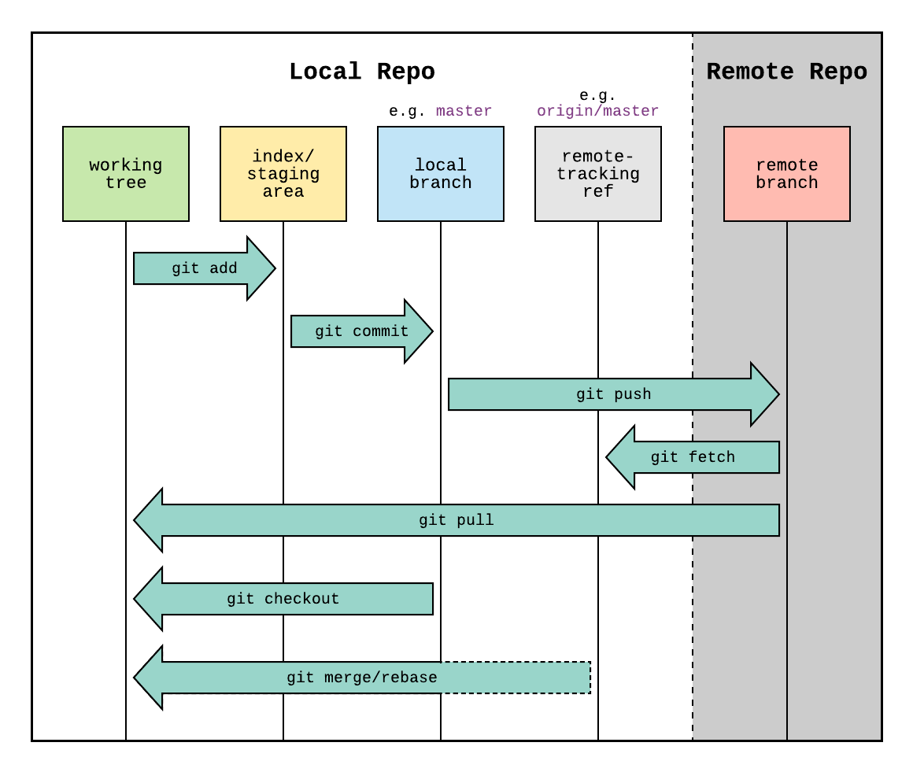

# Git – podstawy

## Czym jest Git?
Git to **rozproszony system kontroli wersji** stworzony przez Linusa Torvaldsa w 2005 roku.  
Umożliwia śledzenie zmian w plikach, cofanie do wcześniejszych wersji i bezpieczną współpracę zespołową.  
Każdy programista ma pełną kopię repozytorium – można pracować **offline**.

---

### Zalety:
- szybki i wydajny  
- działa offline  
- zapewnia integralność danych  
- obsługuje gałęzie (branching)  
- kompatybilny z wieloma protokołami

### Kluczowe pojęcia:

- **Repozytorium** – historia projektu i wszystkie jego pliki  
- **Commit** – zapis zmian z opisem  
- **Branch (gałąź)** – równoległa wersja rozwoju  
- **Merge** – łączenie zmian z różnych gałęzi  

### Trzy obszary Gita:
1. **Working Directory** – pliki, nad którymi pracujesz  
2. **Staging Area** – przygotowane do zapisu zmiany  
3. **Repository** – zapisane commity  

---

## Instalacja

Instalujemy ostatnią stabilną wersję dla danej wersji Debian/Ubuntu.
```bash
apt-get install git
```
Następnie sprawdzamy czy instalacja się powiodła jedną z 2 poniższych komend.


```bash
git

git version
```

### Podstawowa konfiguracja Git

Najważniejszą czynnością będzie skonfigurowanie nazwy użytkownika oraz email. Będą wykorzystywane do przypisywania zmian oraz do identyfikacji z zewnętrznymi systemami.
Użyj poniższych komend z Twoim danymi.

```bash
git config --global user.email=TWOJ_ADRES_EMAIL_TUTAJ@EXAMPLE.COM
git config --global user.username=TWOJA_NAZWA_UZYTKOWNIKA
```

Parametr --global ustawia dane globalnie. Gdy chcemy ustawić je dla konkretnego repozytorium, należy użyć komendy bez tego parametru.

Następnie warto sprawdzić czy kongiguracja przebiegła prawidłowo oraz czy nasze dane się zgadzają

```bash
git config --list
```

---

## Najważniejsze komendy

```bash
git init                    # utwórz repozytorium
git add .                   # dodaj zmiany do staging area
git commit -m "Opis zmian"  # zapisz zmiany
git status                  # sprawdź status
git log                     # pokaż historię commitów
```


<p align="center">
  
</p>

---

## Praca z gałęziami (branch)

Branch pozwala na pracę nad kodem w odosobnieniu. Proces tworzenia nowego brancha można sobie wyobrazić jak proces kopiowania kodu, nad którym możemy pracować bez obaw, że zmiany innych mogą skomplikować naszą pracę.

Tworzenie brancha jest bardzo proste. Można to zrobić za pomocą komendy:

```bash
git branch nazwa-naszego-nowego-brancha
```

Ta komenda tworzy tylko nowy branch, ale nie przełączamy się na niego. Do przełączenia się na nowy branch należy użyć:

```bash
git checkout nazwa-naszego-brancha
```

Jeśli chcemy utworzyć nowy branch i jednocześnie się na niego przełączyć można jeszcze użyć komendy:

```bash
git checkout -b nazwa-naszego-brancha
```

Po skończonej pracy nad funkcjonalnością na osobnym branchu chcemy połączyć nowe zmiany, czyli zrobić merge. Do łączenia zmian głównej linii i naszej służy komenda `git merge`.

Przełącz się na branch główny.
```bash
git checkout master
```
Połącz zmiany.
```bash
git merge nazwa-naszego-brancha
```
Jeśli nie będzie konfliktów, to zmiany zostaną połączone. Jeśli pojawią się konflikty, należy rozwiązać je, sprawdzając konfliktujące się pliki. Wykorzystaj komendę `git status` do tego.

---

## Praca zdalna

| **Komenda**  | **Działanie**                          |
|--------------|----------------------------------------|
| `git clone`  | pobiera repozytorium                   |
| `git push`   | wysyła zmiany do repozytorium zdalnego |
| `git pull`   | pobiera i scala zmiany                 |
| `git fetch`  | pobiera zmiany bez scalania            |
| `git remote` | zarządza repozytoriami zdalnymi        |

Popularne platformy: **GitHub**, **GitLab**, **Bitbucket**

---

## Zaawansowane funkcje

| **Funkcja** | **Opis** | **Komenda**                     |
|-------------|----------|---------------------------------|
|Rebase|porządkuje historię commitów| `git rebase master`             |
|Cherry-pick|wybiera pojedynczy commit z innej gałęzi| `git cherry-pick <commit hash>` |
|Stash|tymczasowo odkłada zmiany| `git stash save "opis zmian"`   |
|Reset|cofa historię (usuwa zmiany)| `git reset --hard HEAD~1`       |
|Revert|tworzy commit cofający poprzedni| `git revert `                   |

---

## Konflikty i ich rozwiązywanie
Konflikt pojawia się, gdy dwie osoby zmieniają ten sam fragment kodu.  
Aby go rozwiązać:
1. Otwórz plik i znajdź znaczniki konfliktu
2. Wybierz właściwą wersję
3. Zapisz plik i wykonaj `git add`, potem `git commit`

### Jak unikać konfliktów:
- często aktualizuj gałąź (`git pull`)
- rób małe commity
- komunikuj się z zespołem

---

## GitHub - platforma dla programistów
Funkcje:
- **Pull Requests** – przegląd i dyskusja nad zmianami  
- **Issues** – zgłaszanie błędów i zadań  
- **Actions** – automatyzacja CI/CD  
- **Pages** – hosting stron  
- **Security** – skanowanie i ochrona kodu  

Dla studentów: **GitHub Student Developer Pack** (darmowe narzędzia, m.in. Copilot).

---

## Bezpieczeństwo

### Ryzyka:
- przypadkowe ujawnienie haseł lub kluczy  
- brak 2FA  
- złośliwy kod w repozytorium  

### Dobre praktyki:
- używaj `.gitignore` dla plików z danymi wrażliwymi  
- stosuj **zmienne środowiskowe**  
- używaj **menedżerów sekretów** (Vault, AWS Secrets Manager)  
- włącz **uwierzytelnianie dwuskładnikowe**

Przykład `.gitignore`:
```bash
# Pliki konfiguracyjne z danymi wrażliwymi
.env
config.json
credentials.yml

# Klucze i certyfikaty
*.pem
*.key
*.cert

# Logi i pliki tymczasowe
*.log
tmp/
```

---

## Git i sztuczna inteligencja

### Wyzwania:
- duże pliki → użyj **Git LFS**  
- wersjonowanie modeli → **DVC**, **MLflow**  
- śledzenie eksperymentów → dedykowane narzędzia AI  

### Narzędzia:
- **GitHub Copilot** – AI asystent kodu  
- **OpenCommit / GitKraken AI** – generowanie komunikatów commitów  
- **DVC** – wersjonowanie danych i modeli  

---

## Najlepsze praktyki

### Commitowanie:
- commituj często i małe zmiany  
- pisz jasne wiadomości (np. `feat: dodaj logowanie`)  

### Praca z gałęziami:
- osobna gałąź dla każdej funkcji  
- utrzymuj czystą gałąź główną (`main`)  
- usuwaj nieużywane gałęzie  

### Zespół:
- używaj **pull requestów** i **issues**  
- dokumentuj zmiany  
- komunikuj się z zespołem  

### Automatyzacja:
- używaj **Git hooks**  
- integruj z **CI/CD**  
- korzystaj z narzędzi graficznych (GitKraken, SourceTree)  

---

## Źródła

Prezentacja PowerPoint zamieszczona w repo

https://devpebe.com/2024/01/24/git-dla-poczatkujacych-kompletny-poradnik-gita/
